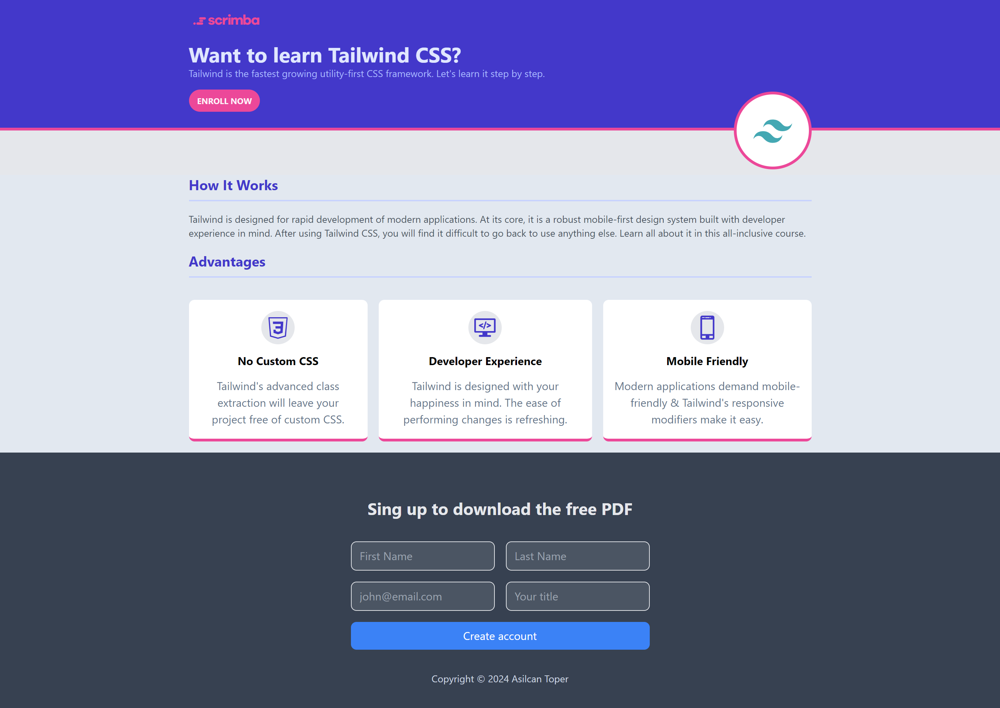

# Tailwind-CSS-Landing-Page
A simple landing page developed solely using Tailwind CSS.

## Live Demo
You can view the live version of this project [here](https://kapteynuniverse.github.io/Tailwind-Landing-Page/)

## Project Acknowledgment
This project was developed as part of the Learn Tailwind CSS course taught by Per Harald Borgen at Scrimba.
